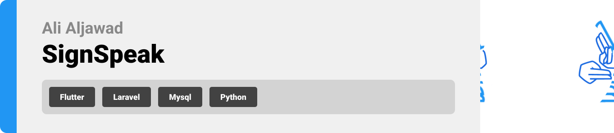
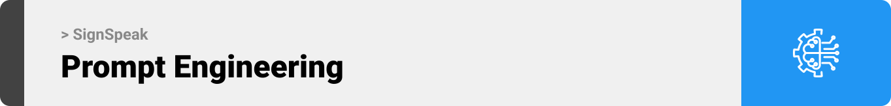
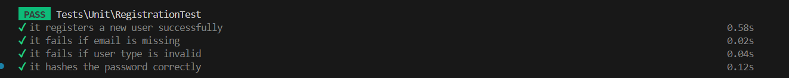
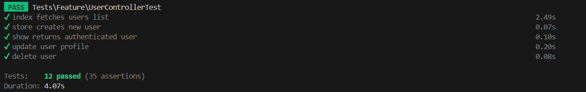

<br><br>

<!-- project philosophy -->


> A mobile app that translates sign language into speech, making communication easier for sign language users.
>
> SignSpeak aims to bridge the communication gap by providing a user-friendly platform that translates sign language into spoken words in real-time. We believe in enhancing accessibility and ensuring effective communication.

### User Stories

#### For Regular Users
- As a regular user, I want to sign into the app, so I can start translating my signs into speech.
- As a regular user, I want to upload videos and images for translation, so I can get speech output from my saved content.
- As a regular user, I want to use real-time translation with my camera, so I can see immediate speech output from my sign language.

#### For Mute Users
- As a mute user, I want to sign into the app, so I can start translating my signs into speech.
- As a mute user, I want to use the app for real-time translation with my camera, so I can see immediate speech output from my sign language.
- As a mute user, I want to access a history of my translations, so I can review and refer back to previous translations.

<br><br>

<!-- Tech stack -->


### SignSpeak is built using the following technologies:

- This project leverages the [Flutter app development framework](https://flutter.dev/), a versatile platform enabling cross-platform app development with a single codebase for mobile, desktop, and web applications.
- For data persistence, the app uses **MySQL**, a widely-used open-source relational database management system.
- The app follows material design guidelines throughout its user interface, ensuring a modern and consistent look.
- For backend services, **SignSpeak** integrates with:
  - **Laravel**: A PHP framework for handling the backend API and managing the database.
  - **Python**: Running the machine learning models for real-time sign language translation via WebSocket and image/video uploads.
  - **Uvicorn**: Utilized to run the ASGI server for handling Python-based endpoints efficiently.
  
<br><br>
<!-- UI UX -->


> We designed SignSpeak using wireframes and mockups, iterating on the design until we reached the ideal layout for easy navigation and a seamless user experience.
- Project Figma design [figma](https://www.figma.com/design/jce22W4lDvg7z5WlfgySeo/SignSpeak?node-id=0-1&node-type=canvas&t=CekBLhJ0QhEw6czf-0)


### Mockups
| Home screen  | Menu Screen | Order Screen |
| ---| ---| ---|
|  |  |  |
<br><br>

<!-- Database Design -->


###  Architecting Data Excellence: Innovative Database Design Strategies:

- Insert ER Diagram here


<br><br>


<!-- Implementation -->


### User Screens (Mobile)
| Login screen  | Register screen | Landing screen | Loading screen |
| ---| ---| ---| ---|
|  |  |  |  |
| Home screen  | Menu Screen | Order Screen | Checkout Screen |
|  |  |  |  |

<br><br>


<!-- Prompt Engineering -->


###  Mastering AI Interaction: Unveiling the Power of Prompt Engineering:

- This project uses advanced prompt engineering techniques to optimize the interaction with natural language processing models. By skillfully crafting input instructions, we tailor the behavior of the models to achieve precise and efficient language understanding and generation for various tasks and preferences.



<br><br>

<!-- AWS Deployment -->


###  Efficient AI Deployment: Unleashing the Potential with AWS Integration:

- This project leverages AWS deployment strategies to seamlessly integrate and deploy natural language processing models. With a focus on scalability, reliability, and performance, we ensure that AI applications powered by these models deliver robust and responsive solutions for diverse use cases.

<br><br>

<!-- Unit Testing -->


###  Precision in Development: Harnessing the Power of Unit Testing:

- This project employs rigorous unit testing methodologies to ensure the reliability and accuracy of code components. By systematically evaluating individual units of the software, we guarantee a robust foundation, identifying and addressing potential issues early in the development process.

<br><br>


<!-- How to run -->


> To set up SignSpeak locally, follow these steps:

### Prerequisites

Ensure that you have the following installed on your machine:
- **Flutter**: [Install Flutter](https://flutter.dev/docs/get-started/install)
- **Laravel**: [Install Laravel](https://laravel.com/docs/installation)
- **Python**: [Download Python](https://www.python.org/downloads/)
- **Uvicorn**: For running the Python server (installed via pip)

### Installation

#### 1. Clone the repository
   ```bash
   git clone https://github.com/AliAljawad/SignSpeak.git
   cd sign-speak
   ```
#### 2. Flutter Frontend Setup
  - Open your Android emulator.
  - Navigate to the Flutter project directory.
  - Run the following commands:
   ```bash
      flutter pub get
      flutter run
   ```
   This will start the Flutter frontend on your emulator.
#### 3. Laravel Backend Setup
- Navigate to the Flutter project directory.
- Run the following command to serve the backend:
```bash
   php artisan serve
   ```
#### 4. Python Model and WebSocket Setup
- Navigate to the Python model directory:
```bash
   cd SignDetectionModel
   ```
- Install the required dependencies:
```bash
   pip install -r requirements.txt
   ```
- To start the WebSocket server for real-time translation, run:
```bash
   python ./webSocket_classifier.py
```
- To start the server that handles uploaded images and videos, run:
```bash
   python -m uvicorn uploaded_files_classifier:app --reload --host 0.0.0.0 --port 8001
```

Now you should be able to run the SignSpeak app locally, with real-time translation and video/image upload features.
